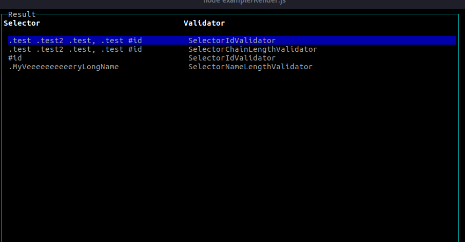

css-checker
===

Setup
===
install

    npm install css-checker --save-dev
    
create your file to validate the css

    "use strict";
    
    const unit = require('unit.js');
    const cssChecker = require('css-checker');
    
    let rules = {
        selector: {
            maxChainLength: 3,
            maxNameLength : 20,
            allowId : false
        },
        attributes: {}
    };
    
    cssChecker.fromString('.test .test2 .test { width: 100%; } #id{background:blue;}', rules)
        .then((result) => {
            cssChecker.render(result);
        })
        .catch((e) => {
            unit.fail(e.message)
        });
        
this code will give you a result like

Implemented Rules
====

### Selector validation

#### SelectorChainLengthValidator

Validate the css selector chain.

    maxChainLength: 3

validates the selector chain like `.foo .bar .baz` that has a value of 3

#### SelectorNameLengthValidator

Validate the css selector name length to keep your names simple

    maxNameLength: 20

validates the selector chain like `.foo` that has a value of 3

#### SelectorIdValidator

Avoid writing IDs

    allowId: false

